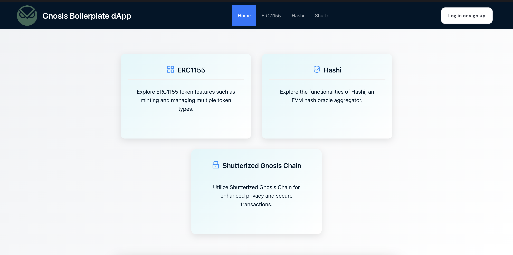

# Gnosis Boilerplate dApp



This is a demo boilerplate application meant for developers to get an idea of Gnosis products and its various integrations.

This boilerplate application has examples of:
- ERC-1155 (A Token standard extensively used by the Circles protocol)
- Hashi 
- Shutter Network API

## Getting Started

Clone the repository
```bash
git clone https://github.com/gnosischain/gnosis-dapp-boilerplate.git
```
Install the nodejs packages
```bash
npm i
```
Run the development server
```bash
npm run dev
```
Please make sure you also use your own Dynmaic Wallet API key.

You can access the front-end at [http://localhost:3000](http://localhost:3000).
